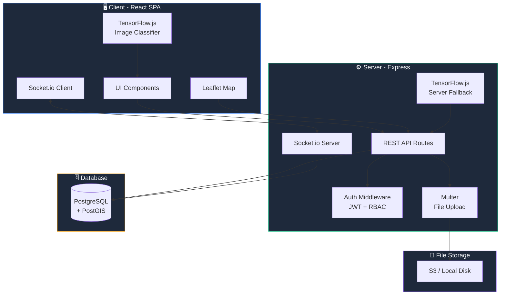

# 🏙️ CityPulse — Tài Liệu Thiết Kế Tổng Hợp

> **CityPulse** — Nền tảng Civic Tech quản lý sự cố đô thị, cho phép người dân báo cáo các vấn đề (ổ gà, ngập lụt, rác thải, hư hỏng hạ tầng...) bằng hình ảnh → AI phân loại tự động → hiển thị trên bản đồ thời gian thực → cơ quan chức năng tiếp nhận & xử lý.

---

## 📌 Phần 1: TỔNG QUAN DỰ ÁN

### 1.1. Tuyên bố vấn đề (Problem Statement)

| Khía cạnh | Chi tiết |
|-----------|---------|
| **Vấn đề** | Đô thị VN đang quá tải: ngập lụt, ổ gà, rác thải, hư hỏng hạ tầng. Người dân không có kênh báo cáo hiệu quả, chính quyền thiếu dữ liệu thời gian thực |
| **Đối tượng** | Người dân đô thị (citizen), Moderator, Admin đô thị (city official) |
| **Giải pháp** | Nền tảng web cho phép crowdsourced reporting + AI classification + realtime map + analytics dashboard |
| **Giá trị** | Cải thiện chất lượng sống đô thị, tăng minh bạch, tối ưu nguồn lực xử lý sự cố |

### 1.2. Mục tiêu dự án

- ✅ Người dân dễ dàng báo cáo sự cố chỉ với 1 bức ảnh + vị trí
- ✅ AI tự động phân loại loại sự cố (pothole, flood, garbage, broken infrastructure...)
- ✅ Hiển thị sự cố trên bản đồ nhiệt thời gian thực (heatmap)
- ✅ Hệ thống upvote/confirm để xác minh sự cố từ cộng đồng
- ✅ Tracking trạng thái: `Reported → Confirmed → In Progress → Resolved`
- ✅ Dashboard phân tích cho chính quyền (thống kê, xu hướng, hiệu suất xử lý)
- ✅ RBAC (Role-Based Access Control) phân quyền rõ ràng

---

## 🛠️ Phần 2: TECH STACK & KIẾN TRÚC

### 2.1. Tech Stack chi tiết

| Layer | Công nghệ | Lý do chọn |
|-------|-----------|------------|
| **Frontend** | React 18 + TypeScript + Vite | SPA nhanh, typesafe, hot reload |
| **Styling** | TailwindCSS 3 + Radix UI | Theo AGENTS.md, component library sẵn |
| **Maps** | Leaflet + React-Leaflet | Open source, miễn phí, hỗ trợ tile server tùy chỉnh |
| **Tile Provider** | OpenStreetMap (miễn phí) hoặc MapBox (có free tier) | Bản đồ chất lượng, hỗ trợ VN |
| **Heatmap** | leaflet.heat | Plugin heatmap cho Leaflet |
| **Backend** | Express.js + TypeScript | Theo AGENTS.md, tích hợp với Vite dev server |
| **Database** | PostgreSQL + PostGIS | Spatial queries (tìm sự cố theo vị trí, bán kính) |
| **ORM** | Drizzle ORM | Typesafe, lightweight, hỗ trợ PostGIS |
| **Realtime** | Socket.io | Cập nhật sự cố mới trên bản đồ theo thời gian thực |
| **AI Classification** | TensorFlow.js (MobileNet transfer learning) | Chạy trên client hoặc server, phân loại ảnh sự cố |
| **File Storage** | Local disk (dev) / S3-compatible (prod) | Lưu ảnh sự cố |
| **Auth** | JWT + bcrypt | Xác thực & phân quyền |
| **Validation** | Zod | Schema validation cả client & server |
| **Charts** | Recharts hoặc Chart.js | Dashboard analytics |

### 2.2. Kiến trúc hệ thống (System Architecture)



### 2.3. Cấu trúc thư mục dự án

```
client/
├── pages/
│   ├── Index.tsx              # Landing page + bản đồ chính
│   ├── ReportIncident.tsx     # Form báo cáo sự cố
│   ├── IncidentDetail.tsx     # Chi tiết 1 sự cố
│   ├── Dashboard.tsx          # Analytics dashboard (admin/official)
│   ├── MyReports.tsx          # Sự cố cá nhân đã báo cáo
│   ├── Login.tsx              # Đăng nhập
│   ├── Register.tsx           # Đăng ký
│   ├── AdminPanel.tsx         # Quản lý user, moderate sự cố
│   └── NotFound.tsx           # 404
├── components/
│   ├── ui/                    # Radix UI components (có sẵn)
│   ├── map/
│   │   ├── IncidentMap.tsx    # Bản đồ chính với markers
│   │   ├── HeatmapLayer.tsx   # Layer bản đồ nhiệt
│   │   ├── IncidentMarker.tsx # Marker cho từng sự cố
│   │   └── LocationPicker.tsx # Chọn vị trí khi báo cáo
│   ├── incidents/
│   │   ├── IncidentCard.tsx   # Card hiển thị sự cố
│   │   ├── IncidentList.tsx   # Danh sách sự cố
│   │   ├── StatusBadge.tsx    # Badge trạng thái
│   │   └── UpvoteButton.tsx   # Nút upvote/confirm
│   ├── dashboard/
│   │   ├── StatsOverview.tsx  # Tổng quan thống kê
│   │   ├── CategoryChart.tsx  # Biểu đồ theo loại sự cố
│   │   ├── TrendChart.tsx     # Biểu đồ xu hướng
│   │   └── ResolutionRate.tsx # Tỷ lệ xử lý
│   ├── layout/
│   │   ├── Header.tsx         # Navbar
│   │   ├── Sidebar.tsx        # Sidebar (admin)
│   │   └── Footer.tsx         # Footer
│   └── ai/
│       └── ImageClassifier.tsx # Component phân loại ảnh
├── hooks/
│   ├── useAuth.ts             # Auth hook
│   ├── useSocket.ts           # Socket.io hook
│   ├── useGeolocation.ts      # Lấy vị trí GPS
│   └── useIncidents.ts        # CRUD sự cố
├── lib/
│   ├── api.ts                 # API client (fetch wrapper)
│   ├── socket.ts              # Socket.io setup
│   └── classifier.ts          # TensorFlow.js model loader
├── App.tsx
└── global.css

server/
├── index.ts                   # Express setup + Socket.io
├── routes/
│   ├── auth.ts                # POST /api/auth/register, login
│   ├── incidents.ts           # CRUD /api/incidents
│   ├── votes.ts               # POST /api/incidents/:id/vote
│   ├── comments.ts            # CRUD /api/incidents/:id/comments
│   ├── dashboard.ts           # GET /api/dashboard/stats
│   └── users.ts               # Admin user management
├── middleware/
│   ├── auth.ts                # JWT verification
│   ├── rbac.ts                # Role-based access control
│   └── upload.ts              # Multer config
├── db/
│   ├── schema.ts              # Drizzle schema + PostGIS
│   ├── connection.ts          # DB connection
│   └── seed.ts                # Seed data
└── utils/
    ├── jwt.ts                 # JWT helpers
    └── geocoding.ts           # Reverse geocoding

shared/
├── api.ts                     # Shared API interfaces
├── types.ts                   # Shared types
└── constants.ts               # Enums, categories
